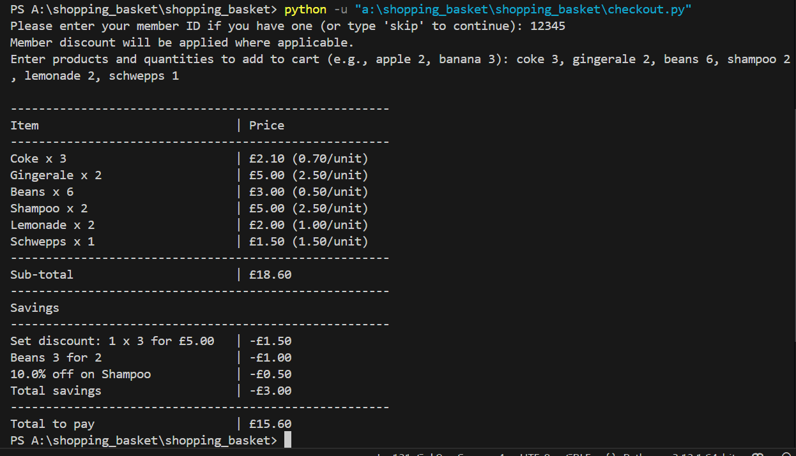

# Shopping Basket

## Introduction
This project is a simple shopping basket system with admin and customer functionalities. It consists of two main files:
- `admin.py`: Manages product inventory and discount settings (accessible only to authorized admins).
- `checkout.py`: Allows customers to add products to their basket and apply available discounts.

## Installation
To use this project, clone the repository and open it in VS Code for easier execution:
```sh
 git clone https://github.com/AditisJain/shopping_basket.git
```

## Admin Functionality (`admin.py`)
Authorized administrators can add new products and discounts to the system. The data is stored in:
- `products.json` (for product details)
- `discounts.json` (for discount rules)

### Running the Admin Script
To run the admin script, use the following command (adjust the path based on your setup):
```sh
 python -u "a:\shopping_basket\shopping_basket\admin.py"
```

### Admin Credentials
- **Username**: `admin@gmail.com`
- **Password**: `admin123`

> **Note:** If incorrect credentials are entered, the program will terminate. Please restart it and try again.

> **Important:** If you are entering a discount for a product that does not exist, you must first add the product before assigning a discount.

## Customer Functionality (`checkout.py`)
Customers can add products to their basket and avail of applicable discounts.

### Running the Checkout Script
Run the checkout script using:
```sh
 python -u "a:\shopping_basket\shopping_basket\checkout.py"
```
(Ensure the path matches your local directory.)

### Membership Benefits
- Customers are prompted to enter a **Member ID** at the start.
- Members receive additional discounts on eligible products.
- You can skip entering the ID, but membership discounts won’t apply.
- Sample Member ID: `12345` (stored in `membership.json`).

### Adding Products to the Basket
When prompted, enter products in the following format:
```sh
 product_name quantity
```
**Example:**
```sh
 beans 3, coke 6, shampoo 2
```
After finalizing the items, a bill will be generated.

## Pricing Rules
The system includes six types of pricing discounts:
1. **Buy X Get Y Free**
2. **Buy X for Y** (e.g., 3 beans for the price of 2)
3. **Buy X for a Fixed Price** (e.g., 2 shampoos for £3)
4. **Any X from a Set for Y Price**
5. **X Percent Off**
6. **Member Discount**

### Discount Application
- Only admins can configure discount values through `admin.py`.
- **No two discounts are combined**. The highest applicable discount is applied.
- Example: If a product qualifies for both a "3 for 5" deal and a "20% off for members" deal, only the greater discount applies.



## Limitations & Future Enhancements
- Additional input validations can be added for better error handling.
- The admin panel can be improved to allow removing and updating products/discounts.
- Checkout can be enhanced with automatic **receipt numbers** and a **purchase history** stored in `purchases.json`.
- Implementing a more robust UI/CLI for smoother interactions.

